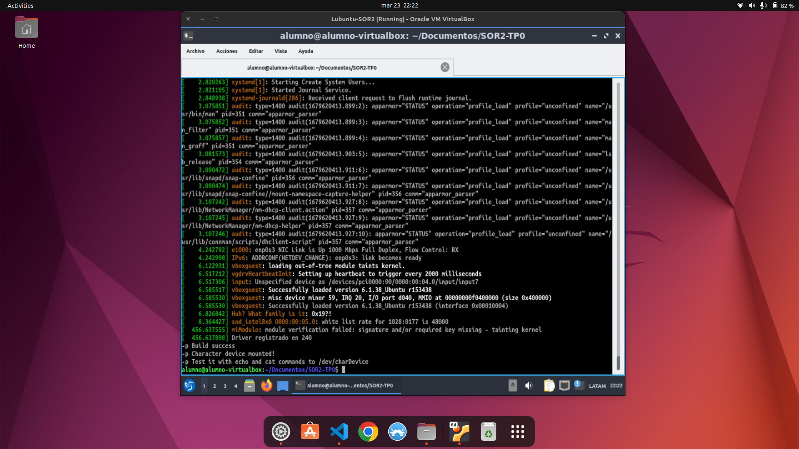
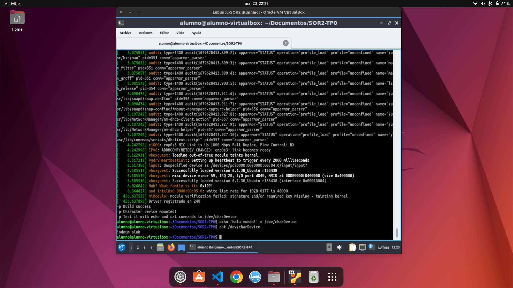

# Trabajo Practico Inicial de Sistemas Operativos y Redes II
## Drivers - Char Device

### Integrantes
#### - Gonzalo Ortelli
#### - Walter Pereyra Lopez

## Pasos para correrlo
**build.sh es un script para automatizar la compilación del driver y el montado del char device**
### Paso 1
Ejecutar script con el comando *bash build.sh*

### Paso 2
Escribir en el device con el comando *echo 'texto' > /dev/charDevice*

### Paso 3
Leer la información escrita en el device con el text invertido con el comando *cat /dev/charDevice*

